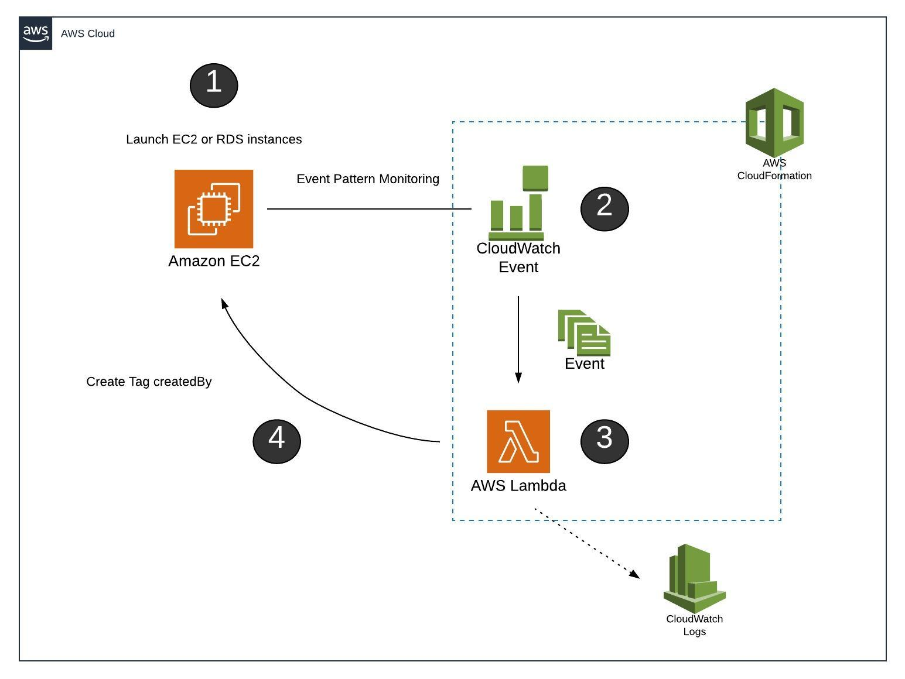

# Automação da Tag CreatedBy usando Lambda

Com o CloudWatch Events e o Lambda, podemos marcar novas instâncias do EC2 e RDS com uma tag que pode dizer quem criou esse recurso.

# Primeiros passos
* O arquivo Cloudformation e o script Python estão prontos para execução, exceto:
    - Insira a Role correta para execução do Lambda;
    - Atualize o S3Bucket e o S3Key para os valores do seu ambiente;
 
# Adicione recursos para marcação
* Para adicionar um novo recurso ao monitoramento e marcação, siga estas etapas:
    - Incluir o eventName e eventSource necessário no CloudWatch Event;
    - Crie uma Role para o script createdby-tag.py acessar os recursos necessários;